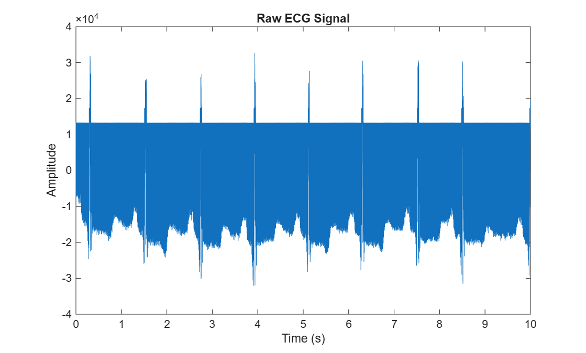
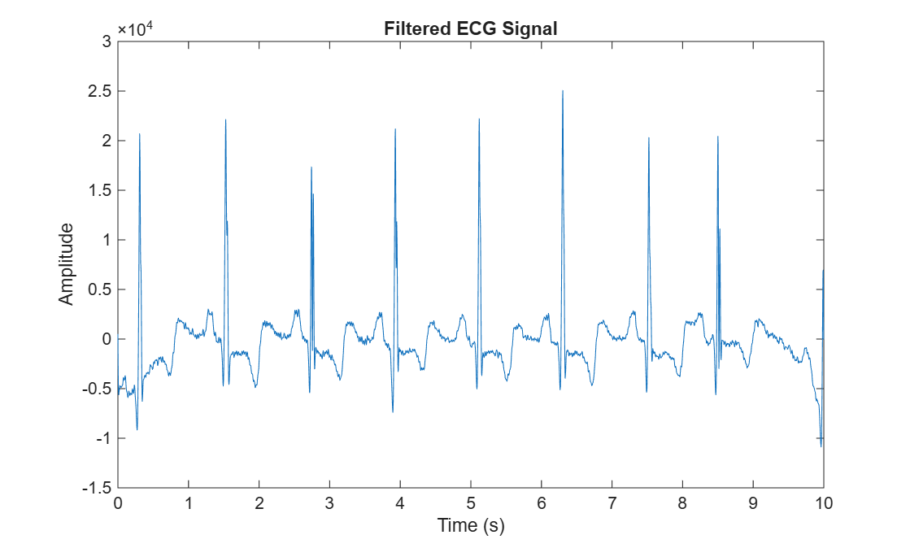
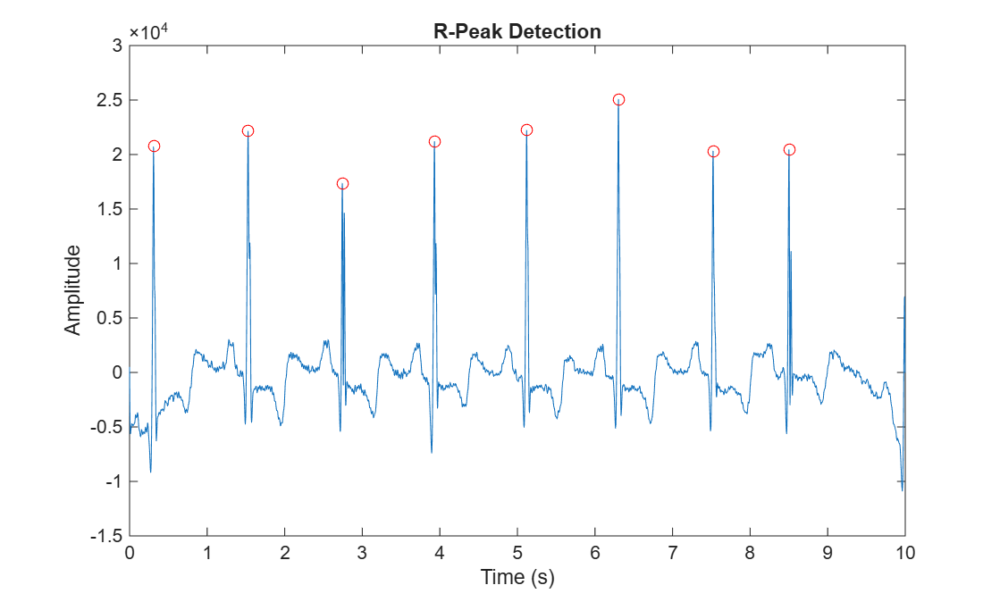

# ECG Signal Analysis using MATLAB (MIT-BIH Dataset)

## Overview

Electrocardiogram (ECG) signals are widely used for diagnosing cardiac conditions, but they are often contaminated with noise such as baseline drift, powerline interference, and muscle artifacts. These distortions make accurate heartbeat detection challenging.

This project implements a complete ECG signal processing pipeline in MATLAB using the MIT-BIH Arrhythmia Database. The system focuses on noise removal, R-peak detection, and heart rate estimation.

---

## Objectives

- Load and visualize ECG signals in MATLAB  
- Remove noise using digital bandpass filtering  
- Detect R-peaks (heartbeats) using signal processing techniques  
- Estimate heart rate (BPM) from RR intervals  
- Analyze ECG waveform behavior before and after filtering  

---

## Dataset

- **Dataset:** MIT-BIH Arrhythmia Database (Record 100)  
- **Source:** PhysioNet  
- **Sampling Frequency:** 360 Hz  
- **Description:** Standard benchmark dataset used for ECG signal processing and arrhythmia research  

---

## Methodology

The ECG processing pipeline consists of the following steps:

1. Load ECG signal from `.dat` file  
2. Extract ECG channel data  
3. Apply bandpass filter (0.5–40 Hz) to remove noise and baseline drift  
4. Detect R-peaks using MATLAB `findpeaks` function  
5. Compute heart rate using RR intervals  

**Why 0.5–40 Hz?**  
This frequency range preserves the QRS complex while removing low-frequency drift and high-frequency noise.

---

## Results

### 🔹 Raw ECG Signal
  
The raw ECG signal contains baseline drift and noise, making peak identification difficult.

---

### 🔹 Filtered ECG Signal
  
After applying a bandpass filter, the signal becomes cleaner with improved visibility of cardiac cycles.

---

### 🔹 R-Peak Detection
  
R-peaks are successfully detected, representing individual heartbeats used for further analysis.

---

## Key Output

- Heart Rate (BPM) estimated from RR intervals  
- Accurate detection of R-peaks in ECG waveform  
- Clear separation of cardiac cycles after filtering  

---

## Tools Used

- MATLAB  
- Signal Processing Toolbox  
- MIT-BIH Dataset (PhysioNet)  
- `findpeaks` function for R-peak detection  

---

## How to Run

1. Open MATLAB  
2. Add project folder to path  
3. Run:

```matlab
ecg_project.m
